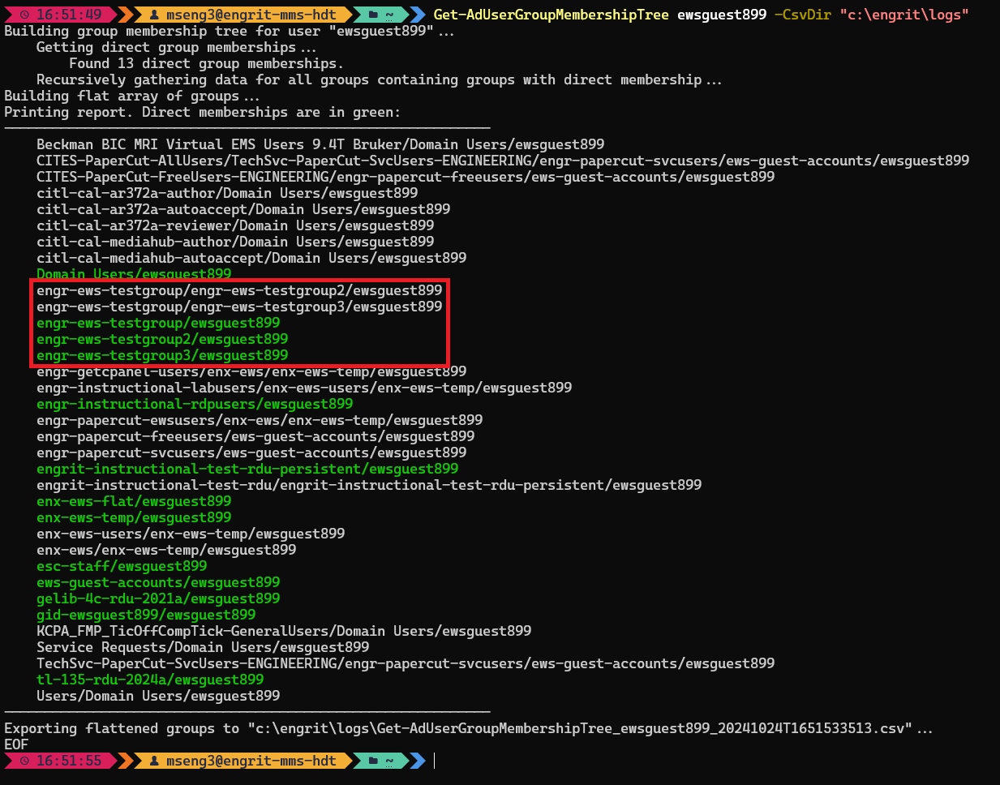

# Summary
Returns data representing all the AD groups a given user belongs to, flattened into an array, but retaining information about whether membership in the groups are direct, nested, or both.  

# Requirements
Must be run as your SU account in order for it to see and return all groups. Running as an account without full provileges will return only a subset of group memberships.  

# Usage
1. Download `Get-AdUserGroupMembershipTree.psm1` to the appropriate subdirectory of your PowerShell [modules directory](https://github.com/engrit-illinois/how-to-install-a-custom-powershell-module).
2. Run it using the examples and documentation provided below.

# Behavior
The key thing about this module is that, while it flattens the list of results for easier consumption and export, those results preserve data gathered while recursively searching all groups of which the given user is a member.  

As a result, some groups may be listed more than once, but each instance represents a different nesting path. Each nesting path denotes whether the given user is a direct member, or a nested member. In cases where both are true, or where users are a member of a group for multiple reasons, then there a nesting path returned for each reason.  

As such, it becomes easy to determine how and why the given user is a nested member of any given group, which is not possible simply by listing that user's normal group memberships.  

In the following example, the user `ewsguest899` is a direct member of `engr-ews-testgroup`, `engr-ews-testgroup2`, and `engr-ews-testgroup3`. Additionally `engr-ews-testgroup2` and `engr-ews-testgroup3` are both members of `engr-ews-testgroup`. So you can easily see that `ewsguest899` is a member of `engr-ews-testgroup` for 3 separate reasons: once as a direct member, and twice as a nested member.  



# Examples

### Common usage
```powershell
Get-AdUserGroupMembershipTree -UserName "username"
```

### Export to C

# Parameters

### UserName
Required string.  
The name of the AD user for which to pull group membership data.  

### PassThru
Optional switch.  
If specified returns all of the flattened group data as an array of PowerShell objects.

### CsvDir
Optional string.  
The directory where a CSV will be saved, containing all of the flattened group data, if specified.  

# Notes
- By mseng3. See my other projects here: https://github.com/mmseng/code-compendium.